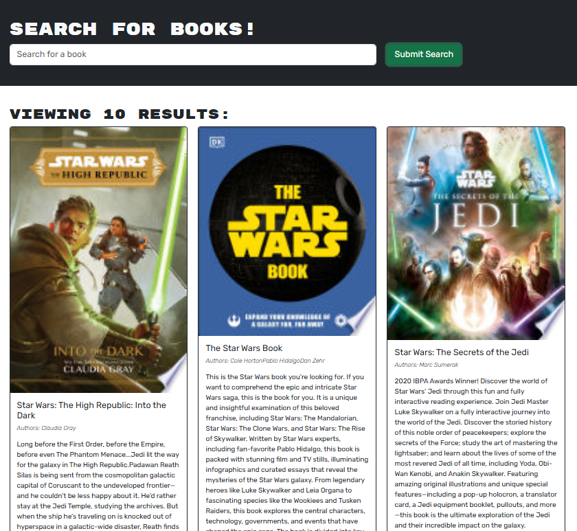

# Book_Search

# Description
Looking for a Book?  Search one up using Google Books API.
You can go to my deployed page or clone it and use it on your own machine.

# Deployed URL

# Installation
1.Clone the repository to your machine.

Github URL :
https://github.com/Lindseyt75/Book_Search.git

2. Install the dependencies.
npm install

3. Set up your MongoDB connection string in a .env file of your project.
MONGODB_URI=your_mongodb_atlas_connection_string

4. Run the application.
npm run develop

# Usage
You can search for books. You can also save your favorites.  You can add and remove books from you saved files.  You can also read a short description of the book.

# Screenshot

